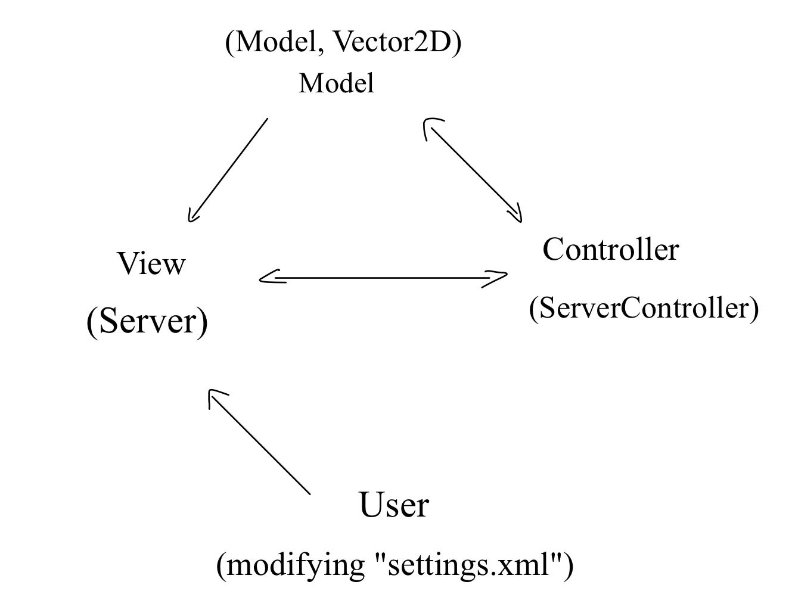

<!-- HTML -->

    

<h1 align="center">Software Practice I | CS 3500 Spring 2021</h1>
<!-- HTML -->

## TankWar Server

The TankWarServer Solution is a standalone solution apart from the client, though they share the same Models. We intentionaly seperated these two solution into two branches for a clearer structure.

#### Functionality

- Allows multiple clients to connect and play the tank war game and allows they to quit the client without affect other active player.
- Allows user to modify the `settings.xml` file to play different game map and game mode.

#### Custom Mode

To enable custom mode, add `<GameMode>1</GameMode>` to `settings.xml` file.

This will allow client(s) to have extra feature other than OG Experience.

- Extra Speed Powerup.
- Extra Low Projectile CD Powerup.
- The projectile will boucing when it hit walls.

## Solution Structure

#### NetworkController

[NetworkController](Libraries/) is a general-purpose (text-based communication) networking library.

The pre-compiled DLL located in the [Resources](Libraries/) project.

#### Server

[Server](../Server) is the startup project, it is just an invoker for the [ServerController](../ServerController).

#### ServerController

[ServerController](../ServerController) project is the Controller for the server, all the main logics, detections, information distributions, etc, all happens here.

#### Model

The models inside [Model](../Model/) project represent the game state and game logic for TankWars.

The project contains following classes:

- [Beam](../Model/)

- [Powerup](../Model/)

- [Projectile](../Model/)

- [Tank](../Model/)

- [Wall](../Model/)

- [World](../Model/)

#### Resources

[Resources](../Resources) Project contains essential files for the game to run. (Images, Pre-compiled DLL)

#### Vector2D

[Vector2D](../Vector2D) project is representing a two-dimentional space vector for the game.

## Design Pattern

For this project, the editors used [Model–View–Controller](https://en.wikipedia.org/wiki/Model–view–controller) as our software design pattern.

As our projects' naming, this solution is clearly structured:

